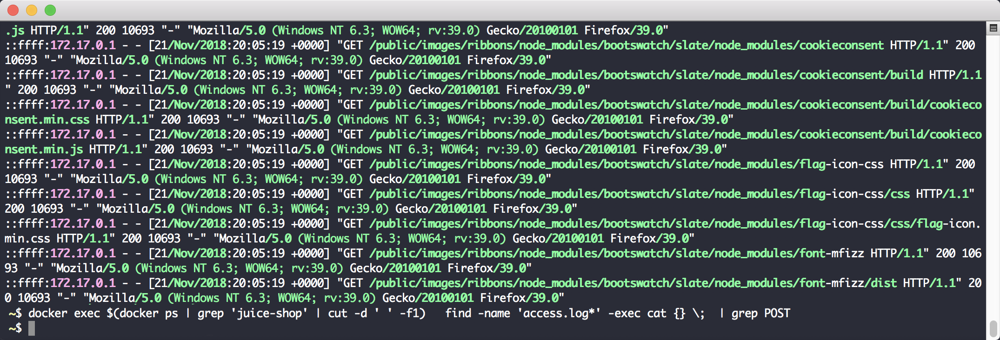

# Getting Started


### ZAP Scan Scripts
ZAP has some scripted scans you can run against your application. We know Juice shop has a number of vulnerabilities, let's see
what ZAP can find in the application. The ZAP project provides some docker images to make it easy to run those scans against your application.


https://github.com/zaproxy/zaproxy/wiki/Docker

```sh
docker run -e JAVA_OPTS='-Xmx4g' -v $(pwd):/zap/wrk/:rw -t owasp/zap2docker-weekly zap-full-scan.py  \
  -t http://172.17.0.2:3000 \
  -g gen.conf \
  -m 1 \
  -j \
  -r testreport.html \
  -z '-config scanner.maxRuleDurationInMins=1 -config scanner.maxScanDurationInMins=1'
```
*Added a couple config items to speed things up*

We can see a few of the challenges were solved but so many of the challenges went unsolved. 

```sh
curl http://localhost:3000/api/Challenges/ \
  | jq '.data[] | select(.solved==true)'
```

Let's see what urls were accessed - exclude the static assets mess.

```sh
 docker exec $(docker ps | grep 'juice-shop' | cut -d ' ' -f1) \
   find -name 'access.log*' -exec cat {} \;  \
   | cut -d ' ' -f7 \
   | sort \
   | uniq \
   | grep -v 'node_modules\|images'
```

Let's also check out the application logs, for how many non `GET` (`POST|PUT|HEAD`) requests have been made.

```sh
docker exec $(docker ps | grep 'juice-shop' | cut -d ' ' -f1) \
  find -name 'access.log*' -exec cat {} \;\
  | grep -v GET

# If you wanna tail the access logs ...
docker exec $(docker ps | grep 'juice-shop' | cut -d ' ' -f1) \
  find -name 'access.log*' -exec tail -f {} \;
```



While ZAP is still running, we can check out how many urls it has found and is processing.

```sh
remote_port=$(docker exec $(docker ps | grep 'zap' | cut -d ' ' -f1) ps aux | egrep -o -m 1 '\-port ([0-9]+)' | cut -d' '  -f2)
cid=$(docker ps | grep 'zap' | cut -d ' ' -f1)

docker exec "$cid" \
  curl -s http://localhost:$remote_port/JSON/core/view/urls/ | jq '.urls | length'

docker exec "$cid" \
  curl -s http://localhost:$remote_port/JSON/ascan/view/scans/ | jq
```

You'll notice there has been none - this is a massive gap in the attack surface. Traditionally, security scanners can read the HTML body and 
identify forms which are submitted and then testing with malicious payload. In this instance, that sort of model does not work. Essentially
the entire application is rendered in the browser, with non-traditional forms and ways of interacting with the server with a REST model.

The good news is we can fill in this gap!

The reality is, every application is custom with enough nuance that an application scanner will struggle to understand
all those details. To have more effective scans, you really need to tailor them to your application. Spending the extra
time to customize the scanner behavior to match your application can make a night and day difference.

