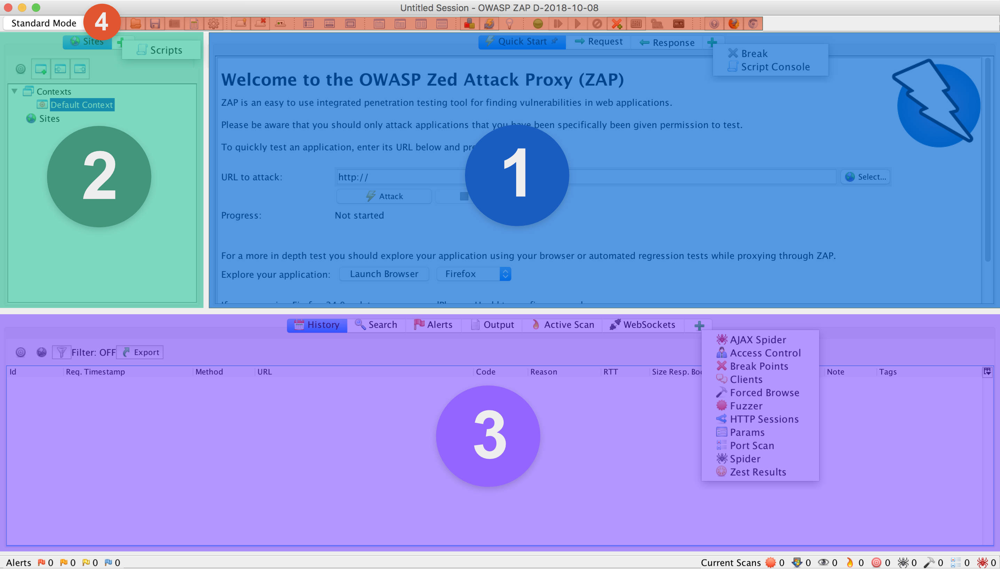
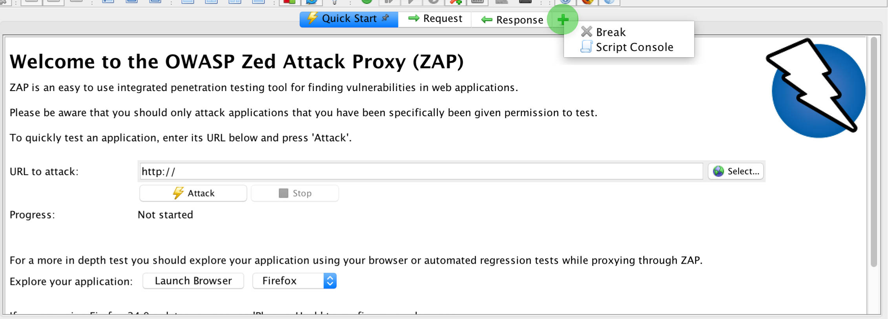
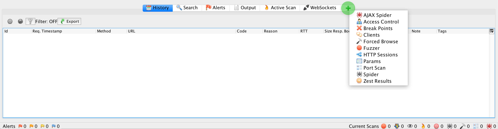
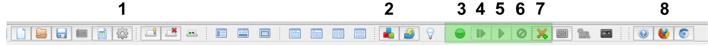

# GUI Overview
We are going to touch on the basics of the GUI to help you get more familiar with ZAP. To enhance the functionality
of your scans, you need to start off in the GUI and configure "all the things". To help you do that, we'll give an 
overview of ZAP's functionality from the GUI perspective. Below you can see the GUI with 4 panels highlighted with more details below!

- [1 Workspace](#panel-1-workspace)
- [2 Sidebar](#panel-2-sidebar)
- [3 Tools](#panel-3-tools)
- [4 Toolbar](#panel-4-toolbar)

## Panel 1 Main Workspace
This panel enables you to view **Request** & **Response** headers and body. When you look at requests from **History** or from **Sites** the details are displayed in this section. or There is is also the **Script Panel** that allows you to modify/run/save your scripts and view any output from the scripts. 

## Panel 2 Sidebar

### Sites

#### Contexts

#### Sites
All requests proxied are used to be help construct a site tree. This helps you visualize the hierarchy of your site. 

### Scripts
ZAP has a powerful scripting engine that allows you to modify/enhance different aspects of ZAP's interactions with your 
web service.. For example, you can modify the headers of every request using scripts!

## Panel 3 Tools
ZAP has tools that help you analyze your application

- History
- Search 
- Alerts
- Output
- Active Scan
- WebSockets
- AJAX Spider
- Access Control
- Breakpoints
- Clients
- Forced Browser
- Fuzzer
- HTTP Sessions
- Params
- Port Scan
- Spider
- Zest Results

## Panel 4 Toolbar
The toolbar has a number of buttons to affects settings or the interface but I'm only going to touch on the aspects that are most commonly used. Over time we'll add more buttons!

### Button 1 - Options
All the detailed options for ZAPs functionality are found here! For example, if you want to set the default Maximum Duration a spider runs for, you set that in the **Options** panel

### Button 2 - Manage Add-ons
Often times there is an extra bit of functionality that an addons provide that you really need! I always add the **Groovy Scripting** and **Python Scripting** addons!

- [ZAP Wiki - Addons](https://github.com/zaproxy/zap-extensions/wiki)
- [Creating Addons](https://www.owasp.org/images/3/37/GuidelineZAPExtensionsAddOns1.0.pdf)

### Button 3-7 - Breakpointing
With breakpointing, you can intercept and modify requests in flight!

- https://github.com/zaproxy/zap-core-help/wiki/HelpStartConceptsBreakpoints
- https://www.youtube.com/watch?v=b6IR2KgiOcw

### Button 8 - Launch Browser
You can launch a browser pre-configured with a blank profile that is proxying through ZAP! This ensures you have a browser with a clean state (so you don't proxy your personal traffic!) with all the settings you need such as the ZAP CA configured.