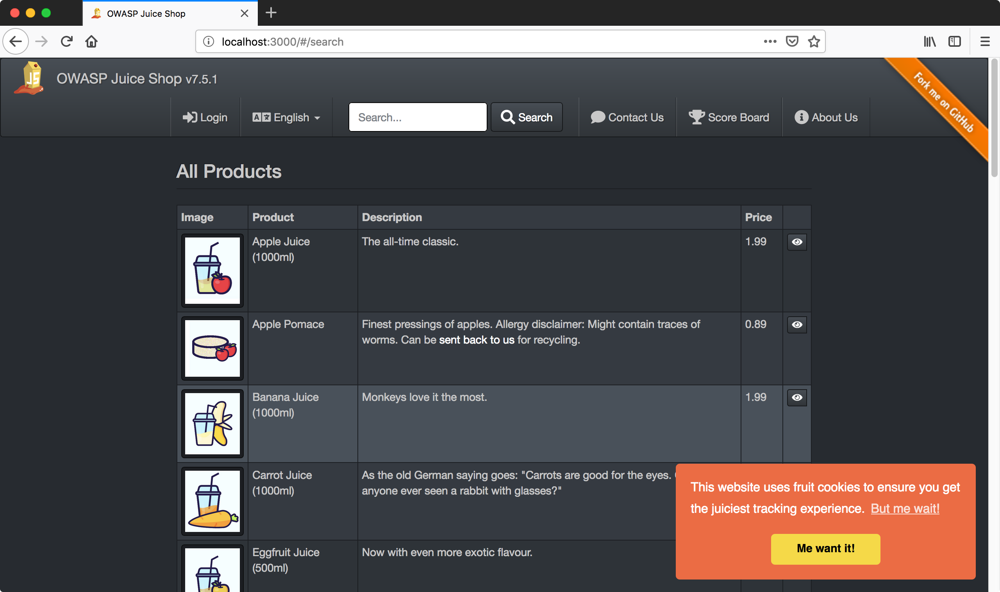
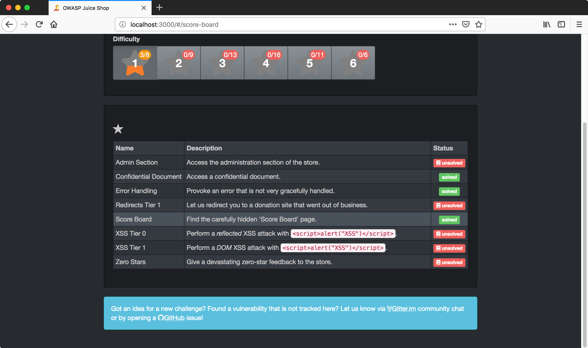
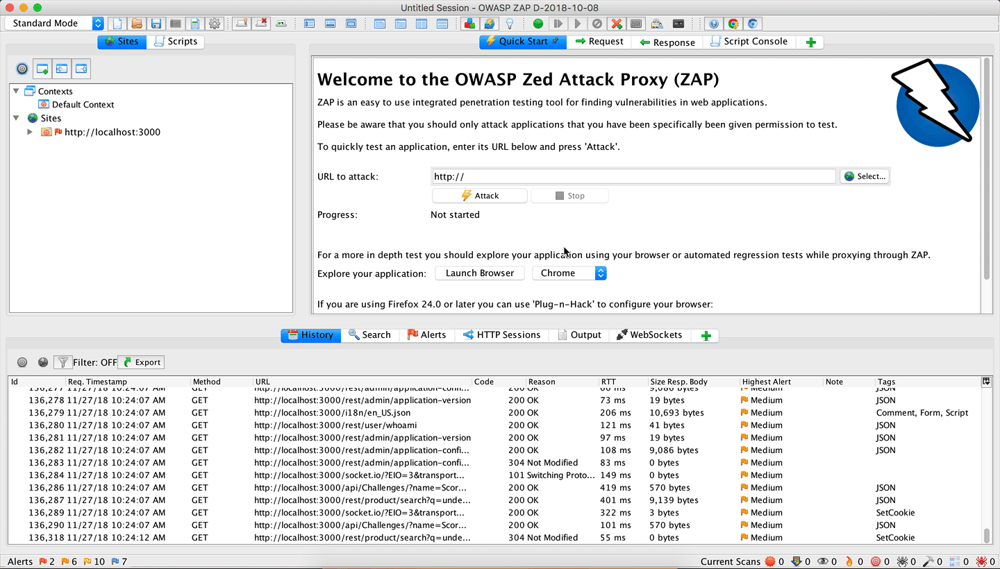

# Challenges



*If you've never done Juice Shop be, warned, this section will give away answers for the easy section*  
Now that we've covered some of the foundational aspects of ZAP, let's take some time to focus on Juice Shop, and then figure out how best to automate testing of Juice Shop. 



If you visit `http://localhost:3000/#/score-board`, you can see the list of challenges. At this point you 
should have solved ~3 challenges as a matter of following the previous steps! Our goal is to script 
completing the following challenges to give you a good understanding of how to automate different scenarios.

- Admin Section
- XSS Tier 0
- XSS Tier 1
- Zero Stars
- Basket Access
- Five-Star Feedback

#### Challenge - Admin Section
*Access the administration section of the store.*  
At the bottom of  ZAP panel there is a tab for **Search** - go ahead and search for `administration`. The first result in 
the list is `juice-shop.min.js` which will highlight part of `AdministrationController`. If you press **Next** a couple times you'll find the string `e.when("/administration" ...`. On of the ways 
angularjs registers routes is using a module called the `$routeProvider` which provides the `when` function
for adding routes. [Example Routing](https://scotch.io/tutorials/single-page-apps-with-angularjs-routing-and-templating)
Using this insight, let's go ahead and navigate to `http://localhost:3000/#/administration` and check out what's there!

You'll notice this is a page in the browser, you cannot curl that same url and get the same response.

##### Scripting

#### Challenge XSS Tier 0
*Perform a reflected XSS attack with `<script>alert("XSS")</script>`.*  

Stepping through the site, there are a number of inputs we can try inputting an XSS. A few places with inputs  without
registering you can try out are.
- In the search bar
- Contact Us Page `http://localhost:3000/#/contact`
- `http://localhost:3000/#/search`
  - Click eye icon by first product
  - Under **Add a review for this product** drop in payload

After you login, there are a few more pages
- `http://localhost:3000/#/complain`
- `http://localhost:3000/#/track-order`
- `http://localhost:3000/#/recycle`

https://www.owasp.org/index.php/Cross-site_Scripting_(XSS)

`http://localhost:3000/#/track-result?id=%3Cscript%3Ealert(%22XSS%22)%3C%2Fscript%3E`

##### Scripting


#### Challenge XSS Tier 1
*Perform a DOM XSS attack with `<script>alert("XSS")</script>`.*  

This is the second XSS challenge, but I think probably the easiest to find. As soon as you load 
the page you'll notice an XSS. At the top bar there is an input for *Search*. Go ahead and input the XSS payload (`<script>alert("XSS")</script>`)
provided and see whats happens.  In ZAP you'll notice a request for `/rest/product/search?q=%3Cscript%3Ealert()%3C/script%3E` but nothing in the response data. The XSS in this case was all rendered on the client, and therefore classified as a DOM based XSS.

`http://localhost:3000/#/search?q=<script>alert("XSS")</script>`

##### Scripting
To reproduce this issue, we need to use a real browser!

#### Challenge - Zero Stars
*Give a devastating zero-star feedback to the store.*     

One of the pages we discovered is a contact page with the option to leave a rating 
(`http://localhost:3000/#/contact`). With this challenge, the goal is to leave feedback of zero-stores. There is no option for 0-stars presented by the interface, if you don't select at least one star you can't submit. So try to use ZAP to work around this, let's go back to the form and fill it out but don't submit.
Before we submit, let's go back into ZAP and toggle the circular record button (to the right of the lightbulb) to **Break on all requests**. Now back in the browser press submit! You will notice ZAP is brought into focus and a request is in view. You should see  the request headers `POST http://localhost:3000/api/Feedbacks/` and also the request body `{"comment":"Comment?","rating":1,"captcha":"11","captchaId":9}`. Let's go ahead and replace the `rating` value of `1` with  `0`. Now press the blue arrow key :arrow_forward: to *Submit and contoinue to the next break point*. If you did everything correctly, in the response you should see `{"status":"success" ... "rating":0, ...}`



```python
captcha = requests.get("%s/rest/captcha/" % root, proxies=proxy, verify=False, headers=headers).json()
data = requests.post("%s/api/Feedbacks/" % root, headers=headers, proxies=proxy, verify=False, data=json.dumps({
  "comment": "Comment?",
  "rating": 0,
  "captcha": captcha["answer"],
  "captchaId": captcha["captchaId"]
})).json()
```

#### Challenge - Basket Access
*Access someone else's basket.*  

##### Broken Authorization
[OWASP A2](https://www.owasp.org/index.php/OWASP_Top_Ten_Cheat_Sheet#A2_Weak_authentication_and_session_management)

An important part of the security of your application is ensuring that users can only see what users should see
and not anything else. In the case of Juice Shop, people should only be able to see their basket and not others.
In this situation, seeing someone else's cart is not the worst thing, but definitely a privacy issue & an issue 
that could be used to springboard to discovery of additional vulnerabilities. But if you were
on another site, buying saying pregnancy tests, simply being able to see other peoples carts is much more problematic.

After you login, Click the **Your Basket** link or navigate to `http://localhost:3000/#/basket`. Back in ZAP
you should notice a request `http://localhost:3000/rest/basket/4` ... *Right Click* (or ^ click for Mac) on the request and a context menu will pop up and then click `Open/Resend with Request editor`. Looking at the request, it looks REST ish with `4` likely the user id from the database. Let's goahead and try changing that number to a lower one & see if we get another basket and then click *Send*. Sure enough we can access someone elses basket! Let's see how many other baskets have content. Incrementally manually is a bothersome, let's check out ZAP's **HTTP Fuzzer** to make this easy! Let's exit the `Request editor` back into the main ZAP ui. Lets go ahead and find the `rest/basket/...` request again in history and click it. In the **&rarr;Request** tab above select the numbrer at the end of the path and then *Right Click*  on the selection. This will prompt you with another context menu with one of the options being **Fuzz**, which you 
need to click. This will bring up the **Fuzzer** dialog with which you can set options. ON the right side you will want to *Click* the button **Payloads**, this will allow you to provide a list of values to replace the seleted text with. Now *click* **Add** which will bring up another prompt. In the dropdown, select **Numberzz** (since we are iterating numbers) and then for the **To** field set a value of `20` and the increment field a value of `1`. After you add those settings, *click* the button **Generate Preview** and then *click* the button **Add** then **Ok**. After that you will be back in the main **Fuzzer** dialog, goahead and *click* **Start Fuzzer**. Below you'll see the **Fuzzer** tab is in focus with a list of requests. 

```python
zap.urlopen("%s/rest/basket/1" % root)
zap.urlopen("%s/rest/basket/2" % root)
```


**Links**  
- [ZAP Fuzzer wiki](https://github.com/zaproxy/zap-core-help/wiki/HelpAddonsFuzzConcepts)
- [Youtube - ZAP Fuzzing](https://www.youtube.com/watch?v=uSfGeyJKIVA)

### Challenge - Five-Star Feedback
*Get rid of all 5-star customer feedback.*  

We already covered the topic of [Broken Authorization](#broken-authorization), above, which relates to 
this section. 

So we already created a 0-star review, but how can we get rid of the existing 5 stars? Earlier, when 
you found `http://localhost:3000/#/administration`, you may have noticed the right column had a table 
with **Customer Feedback**. If you are logged in with your test user, you'll notice there is a red trash can icon on the right side of each table row. (if you are not logged in, go ahead and log in). Go ahead and click the trash icon next to the first review that has 5-stars. Back in ZAP, checking the **History** tab at the bottom and notice the requests, there is a new one - `DELETE http://localhost:3000/api/Feedbacks/1`!
No sort of authorization check was performed, as a authenitcated user you were able to 

```python
requests.delete("%s/api/Feedbacks/1" % root, proxies=proxy, verify=False)
```

#### Breakpoints
Let's go back to the list of products, `http://localhost:3000/#/search`. If you click the eye icon to the 
right of a product entry, a dialog will pop up. In that dialg you can `Add a review for this product` 
and submit! Let's go ahead and fill it out with `Awesome!`. Before we submit, let's go back into ZAP and 
toggle the circular record button (to the right of the lightbulb) to **Break on all requests**. Now back in
the browser press submit! You will notice ZAP is brought into focus and a request is in view. You should 
see  the request headers `PUT http://localhost:3000/rest/product/1/reviews` and also the request body 
`{"message":"Awesome!","author":"Anonymous"}`. Let's go ahead and replace the message attribute with  
`<script>alert(\"XSS\")</script>`. Now press the blue arrow key to *Submit and continue to the next  break point*

**Links** 
- [ZAP Blog - Breakpoints Tutorial](https://zaproxy.blogspot.com/2015/12/zap-newsletter-2015-december.html#Tutorial)
- [Youtube - ZAP Breakpoints Part 1](https://www.youtube.com/watch?v=b6IR2KgiOcw)
- [Youtube - ZAP Breakpoints Part 2](https://www.youtube.com/watch?v=H2tKdwMcKnk)
