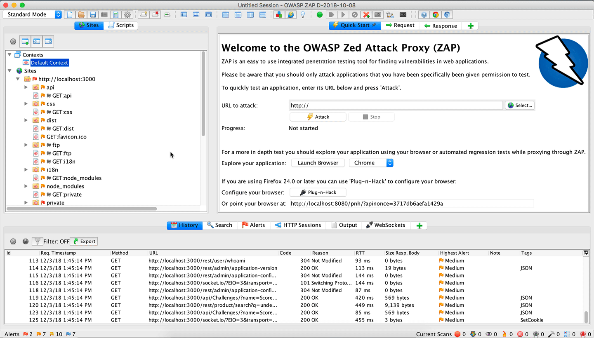
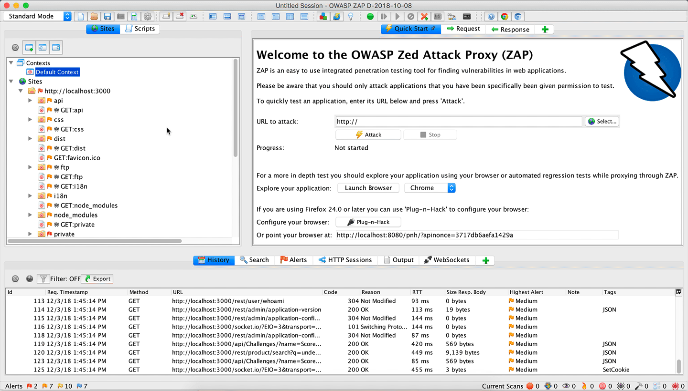

# Putting the Pieces Together

We've gone through different aspects of ZAP's functionality, tuning & configuring everything to
improve the quality of the scans for Juice Shop. Now the question is, how do we put all those 
pieces together, so we can run the `zap-full-scan.py` fully customized with everything we've worked on?

### Exporting Context

## Exportingc URLs

